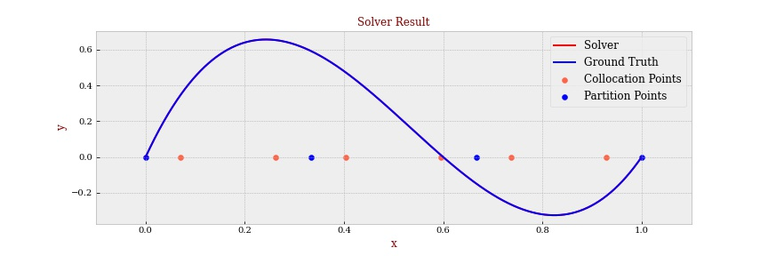
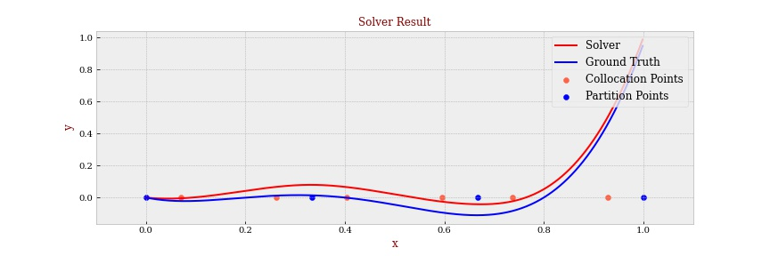
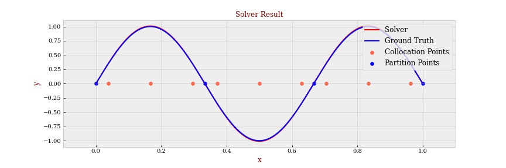
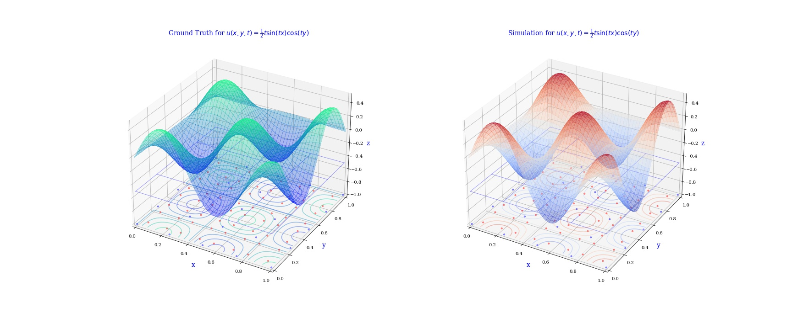
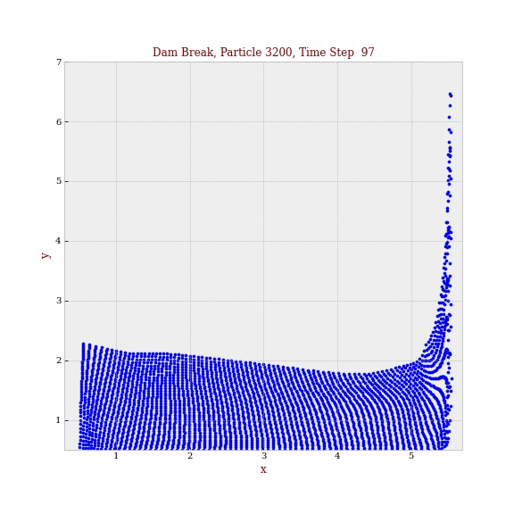
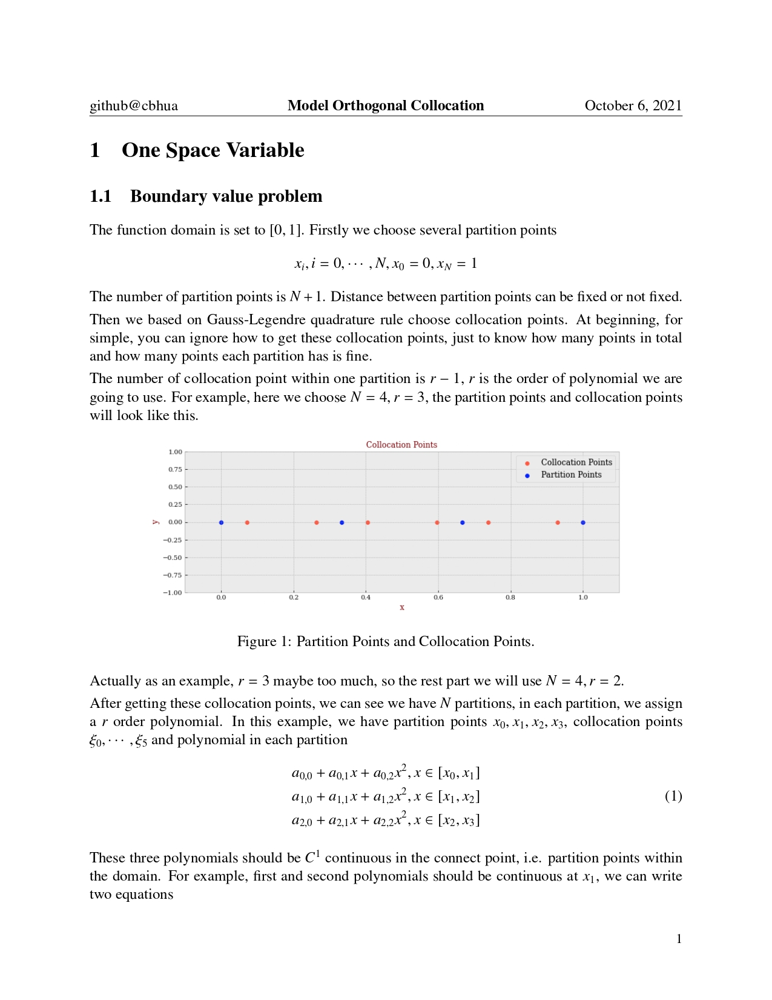
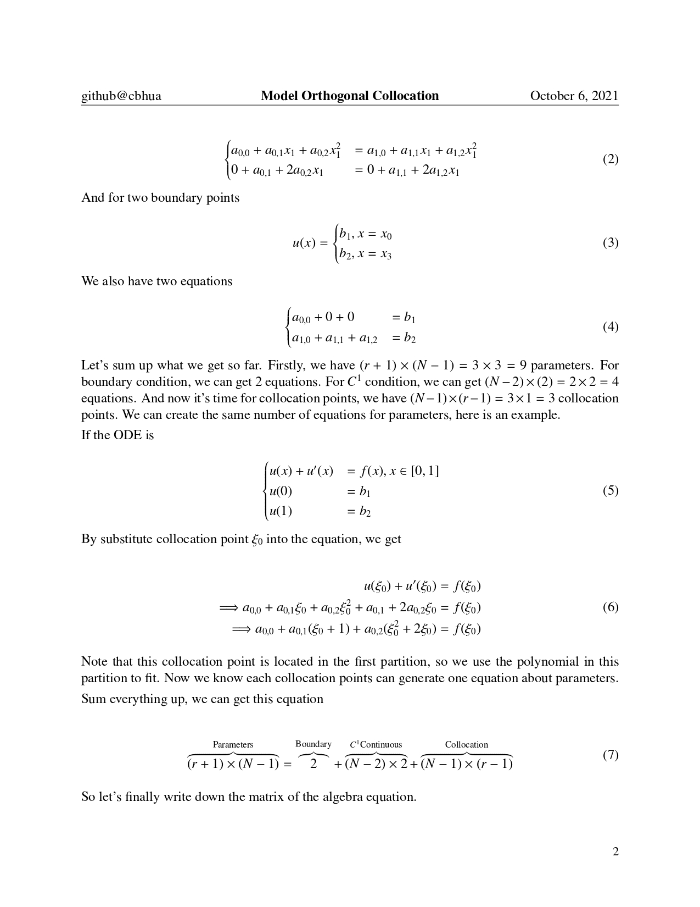
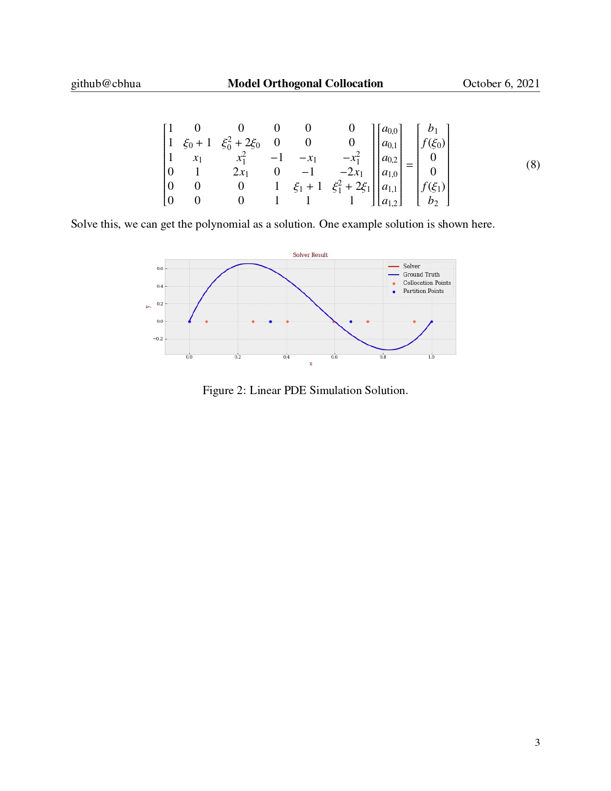

# 🧮 KSE 801 Final Report with Code

This is the final report with code for KAIST course KSE 801.

Author: Chuanbo Hua, Federico Berto. 

## 💡 Introduction About the OSC

**Orthogonal collocation** is a method for the [numerical solution of partial differential equations](https://en.wikipedia.org/wiki/Numerical_partial_differential_equations). It uses [collocation](https://en.wikipedia.org/wiki/Collocation_method) at the zeros of some [orthogonal polynomials](https://en.wikipedia.org/wiki/Orthogonal_polynomials) to transform the [partial differential equation](https://en.wikipedia.org/wiki/Partial_differential_equation) (PDE) to a set of [ordinary differential equations](https://en.wikipedia.org/wiki/Ordinary_differential_equation) (ODEs). The ODEs can then be solved by any method. It has been shown that it is usually advantageous to choose the collocation points as the zeros of the corresponding [Jacobi polynomial](https://en.wikipedia.org/wiki/Jacobi_polynomial) (independent of the PDE system) [1]. 

Orthogonal collocation method was famous at 1970s, mainly developed by BA Finlayson [2]. Which is a powerful collocation tool in solving partial differential equations and ordinary differential equations.

Orthogonal collocation method works for more than one variable, but here we only choose one variable cases, since this is more simple to understand and most widely used. 

## 💡 Introduction About the GNN

You can find more details from the jupter notebook within `gnn-notebook` folder. We include the dataset init, model training and test in the folder. 

**Reminder**: for dataset, we provide another repository for dataset generator. Please refer to repo: https://github.com/DiffEqML/pde-dataset-generator. 

## 🏷 Features

- **Turoritals**. We provide several examples, including linear and nonlinear problems to help you to understand how to use it and the performance of this model.
- **Algorithm Explanation**.  We provide a document to in detail explain how this alogirthm works by example, which we think it's easier to get. For more detail, please refer to Algorithm section.

## ⚙️ Requirement

```python
Python Version: 3.6 or later
Python Package: numpy, matplotlib, jupyter-notebook/jupyter-lab, dgl, torch
```

## 🔧 Structure

- `src`: source code for OSC algorithm. 
- `fig`: algorithm output figures for readme
- `osc-notebook`: tutorial jupyter notebooks about our osc method
- `gnn-notebook`: tutorial jupyter notebooks about graph neural network 
- `script`: some training and tesing script of the graph neural network

## 🔦 How to use

**Step 1**. [Download](https://github.com/cbhua/model-orthogonal-collocation/archive/refs/heads/main.zip) or [Clone](git@github.com:cbhua/model-orthogonal-collocation.git) this repository.

**Step 2**. Refer to `osc-notebook/example.ipynb`, it will introduce how to use this model in detail by examples. Main process would be 

1. `collocation1d()`: generate collocation points.
2. `generator1d()`: generate algebra equations from PDEs to be solved.
3. `numpy.linalg.solve()`: solve the algebra equations to get polynomial result, 
4. `polynomial1d()`: generate simulation value to check the loss. 

**Step 3**. Refer to notebooks under `gnn-notebook` to get the idea of training graph model. 

## 📈 Examples

**One variable, linear, 3 order** `Loss: <1e-4`



**One variable, linear, 4 order** `Loss: 2.2586`



**One variable, nonlinear** `Loss: 0.0447`



**2D PDEs Simulation**



**Dam Breaking Simulation**



## 📜 Algorithm

Here we are going to simply introduce how 1D OSC works by example. Original pdf please refer to `Introduction.pdf` in this repository. 








## 📚 References

[1] Orthogonal collocation. (2018, January 30). In *Wikipedia*. https://en.wikipedia.org/wiki/Orthogonal_collocation.

[2] Carey, G. F., and Bruce A. Finlayson. **"Orthogonal collocation on finite elements."** *Chemical Engineering Science* 30.5-6 (1975): 587-596.
